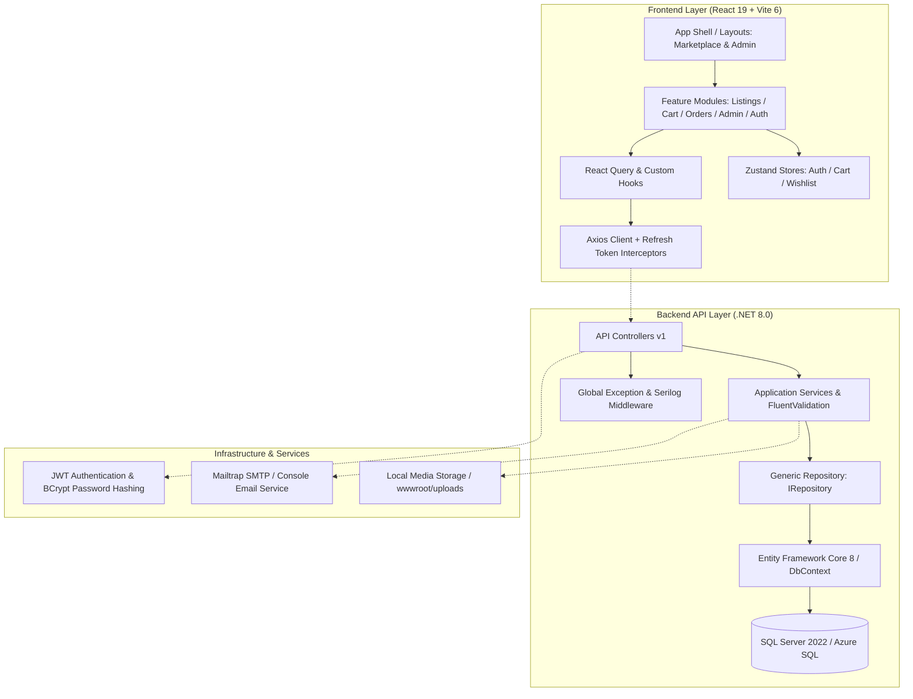

# 🛍️ ShopEase — Enterprise Marketplace Platform

[](#-getting-started)
[](Frontend)
[](Backend)
[](#-database)
[](#-architecture-overview)

Welcome to **ShopEase**, an enterprise-grade e-commerce marketplace platform engineered with **ASP.NET Core 8 Web API** and **React 19**. Designed around Onion Architecture and a unified account model, ShopEase enables seamless multi-vendor buying and selling experiences.

---

## 🏗️ Architecture Overview

The system is architected using **Onion Architecture** and the **Generic Repository Pattern**, cleanly separating domain models, application logic, data persistence, and HTTP presentation layers.



### Key Highlights & Features
- **Unified Account Model**: Single user authentication model support (`Personal` & `Business` accounts). Every user has universal capabilities to buy and list products.
- **Dynamic Category Attributes Engine**: Flexible dynamic category attribute fields (`CategoryAttribute`, `AttributeOption`, `ListingAttributeValue`) supporting conditional visibility rules and custom field rendering.
- **Robust Security & RBAC**: Dual-token strategy with 15-minute access tokens and 7-day refresh tokens, BCrypt password hashing, and client/server role-based authorization (`User`, `Admin`).
- **Complete Marketplace Lifecycle**: Advanced product search, dynamic multi-attribute filtering, rich multi-image upload, cart drawer, checkout, order tracking, and administrative moderation dashboard.
- **Standardized API Envelope & Soft Deletes**: Universal `ApiResponse<T>` wrapping, paginated `PagedResult<T>` structures, and global soft-delete query filters (`BaseEntity.IsDeleted`).

---

## 🛠️ Technology Stack

| Layer | Technologies Used |
| :--- | :--- |
| **Frontend** | React 19, Vite 6, Tailwind CSS 3, Zustand, TanStack React Query, React Hook Form, Zod, Axios, Lucide Icons |
| **Backend** | ASP.NET Core 8 Web API, C#, Entity Framework Core 8, FluentValidation, Serilog |
| **Architecture** | Onion Architecture (Domain, Application, Infrastructure, API), Generic Repository Pattern |
| **Database** | Microsoft SQL Server 2022 / Azure SQL Server (`ShopEaseDb`) |
| **Authentication** | JWT (JSON Web Tokens) + Refresh Tokens, BCrypt Password Hashing (`BcryptPasswordHasher`) |
| **Storage & Media** | ASP.NET Core Static File Server (`wwwroot/uploads`) & `LocalFileStorageService` |
| **Email Service** | Mailtrap SMTP Sandbox / `ConsoleEmailService` |
| **Containers** | Docker, Docker Compose, Nginx (Production Reverse Proxy & SPA Fallback) |

---

## 📁 Repository Directory Structure

```text
shop-ease/
├── Backend/                      # ASP.NET Core 8 Web API Solution
│   ├── Dockerfile                # Multi-stage container build (.NET 8 SDK -> Runtime)
│   └── src/
│       ├── EBayClone.API/        # REST Controllers, Serilog, Middleware, Swagger UI, DI Setup
│       ├── EBayClone.Application/# Business Logic, Services, DTOs, FluentValidation
│       ├── EBayClone.Infrastructure/# EF Core DbContext, Repositories, JWT, Storage, Email
│       └── EBayClone.Domain/     # Entities, Enums, Interfaces (IRepository<T>)
├── Frontend/                     # React 19 SPA (Vite 6 + Tailwind CSS)
│   ├── Dockerfile                # Multi-stage container build (Node -> Nginx)
│   ├── nginx.conf                # Nginx SPA fallback routing & /api proxy setup
│   └── src/
│       ├── app/                  # Router setup & main application shell
│       ├── components/           # Reusable UI components (Buttons, Inputs, Modals, Badges)
│       ├── constants/            # API Endpoints, App Routes, Enum definitions
│       ├── features/             # Modular features (listings, auth, cart, orders, admin)
│       ├── layouts/              # MarketplaceLayout & AdminLayout
│       ├── services/             # Axios API instance & HTTP interceptors
│       ├── store/                # Zustand global state (authStore, cartStore, wishlistStore)
│       └── utils/                # Date/Currency formatters & asset URL helpers
├── docs/                         # Comprehensive Technical Documentation
│   ├── api-contract.md           # Endpoint definitions & request/response shapes
│   ├── architecture.md           # Onion layer breakdown & sequence diagrams
│   ├── database.md               # Schema definitions, migrations & ER notes
│   ├── design.md                 # Design system tokens & UI rules
│   └── setup.md                  # Detailed environment configuration guide
├── postman/                      # Postman API Collection & environment files
├── docker-compose.yml            # Multi-container orchestration (SQL Server + API + Web)
└── .env.example                  # Root Environment Template
```

---

## 🌐 Port Reference

| Service | Local Dev | Docker Compose |
| :--- | :--- | :--- |
| **Frontend SPA** | `http://localhost:5173` | `http://localhost:80` |
| **Backend API** | `http://localhost:5000` | `http://localhost:5000` *(maps container 8080)* |
| **Swagger UI** | `http://localhost:5000/swagger` | `http://localhost:5000/swagger` |
| **Health Check** | `http://localhost:5000/health` | `http://localhost:5000/health` |
| **SQL Server** | `localhost:1433` | `localhost:1433` |

---

## 🚀 Getting Started

### Prerequisites
- [.NET 8.0 SDK](https://dotnet.microsoft.com/download/dotnet/8.0)
- [Node.js (v20+)](https://nodejs.org/) & `npm`
- Microsoft SQL Server 2022 or SQL Server LocalDB
- *(Optional)* [Docker Desktop](https://www.docker.com/) for containerized deployment

---

### Option 1: Docker Compose (Recommended)

Run the full stack with zero manual local configuration:

```bash
# 1. Clone & copy environment template
cp .env.example .env

# 2. Start all services (SQL Server -> Backend API -> Frontend Nginx)
docker-compose up -d

# 3. View backend logs
docker-compose logs -f backend
```

Once running, access the web application at **`http://localhost`** and API documentation at **`http://localhost:5000/swagger`**.

---

### Option 2: Local Development Setup

#### 1. Backend Setup

```bash
# Navigate to Backend directory
cd Backend

# Restore dependencies
dotnet restore

# Run API Server (Runs on http://localhost:5000)
dotnet run --project src/EBayClone.API
```

> **Note**: The backend automatically applies database migrations and seeds initial database records on startup.

To apply database migrations manually:
```bash
dotnet ef database update \
  --project src/EBayClone.Infrastructure \
  --startup-project src/EBayClone.API
```

#### 2. Frontend Setup

```bash
# Navigate to Frontend directory
cd Frontend

# Create local environment configuration
cp .env.example .env

# Install Node dependencies
npm install

# Start Vite development server (Runs on http://localhost:5173)
npm run dev
```

---

## ⚙️ Environment Variables

### Root `.env` (Docker Compose)

```env
# Database Settings
DB_SERVER=sqlserver
DB_PORT=1433
DB_NAME=ShopEaseDb
DB_USER=sa
DB_PASSWORD=YourStrong@Passw0rd

# JWT Security Settings
JWT_SECRET=replace-with-a-secret-at-least-32-characters-long
JWT_ISSUER=ShopEaseApi
JWT_AUDIENCE=ShopEaseFrontend
JWT_EXPIRY_MINUTES=15
JWT_REFRESH_EXPIRY_DAYS=7

# Application URLs
FRONTEND_URL=http://localhost:5173
BACKEND_URL=http://localhost:5000

# Runtime Environments
ASPNETCORE_ENVIRONMENT=Development
NODE_ENV=development
```

---

## 📡 API Documentation & Key Endpoints

Interactive Swagger API documentation is available at **`/swagger`** in all environments.

| Method | Endpoint | Auth Required | Description |
| :--- | :--- | :--- | :--- |
| `POST` | `/api/v1/auth/register` | No | Register a new user account |
| `POST` | `/api/v1/auth/login` | No | Authenticate user & issue tokens |
| `POST` | `/api/v1/auth/refresh` | No | Refresh expired access token |
| `GET` | `/api/v1/listings` | No | Search & filter product listings (paginated) |
| `POST` | `/api/v1/listings` | Required | Create a new product listing |
| `GET` | `/api/v1/orders` | Required | Fetch current user order history |
| `POST` | `/api/v1/cart/checkout` | Required | Checkout active shopping cart |
| `GET` | `/health` | No | System health check endpoint |

All listing endpoints support standard query parameters: `page`, `pageSize`, `sortBy`, and `sortDirection`. All API responses return standard `ApiResponse<T>` envelopes.

---

## 🔒 Default Credentials

| Role | Email | Password |
| :--- | :--- | :--- |
| **Admin** | `admin@shopease.com` | `Admin@123` |
| **Standard User** | `user@shopease.com` | `User@123` |

---

## 📚 Technical Documentation

For in-depth operational and technical specifications, explore the [`docs/`](docs/) directory:

- 📖 **[Architecture Guide](docs/architecture.md)** — Layer breakdown, sequence diagrams, and software patterns.
- 🔌 **[API Contract](docs/api-contract.md)** — Complete REST endpoint specifications, request contracts, and error responses.
- 🗄️ **[Database Documentation](docs/database.md)** — Entity schemas, EF Core configurations, and seed specifications.
- 🎨 **[Design System](docs/design.md)** — UI tokens, color palettes, and component guidelines.
- 🚀 **[Setup Guide](docs/setup.md)** — Extended local, Docker, and Azure deployment procedures.

### Postman Collection
Import `postman/shopease.postman_collection.json` into Postman to quickly test all API endpoints with pre-configured environment scripts.

---

## 🔧 Troubleshooting

- **Backend fails to connect to database**: Ensure SQL Server is running on port `1433`. When using Docker Compose, wait for the SQL Server container to become healthy before checking API logs.
- **CORS Errors**: Verify `FRONTEND_URL` in `.env` or `CorsSettings:AllowedOrigins` in `appsettings.json` matches your frontend origin precisely without trailing slashes.
- **Frontend 404 on refresh**: Ensure Nginx SPA fallback (`try_files $uri /index.html`) is active in production builds.
- **401 Unauthorized errors**: Access tokens expire after 15 minutes. Ensure refresh token calls (`/api/v1/auth/refresh`) are firing automatically via Axios interceptors.
